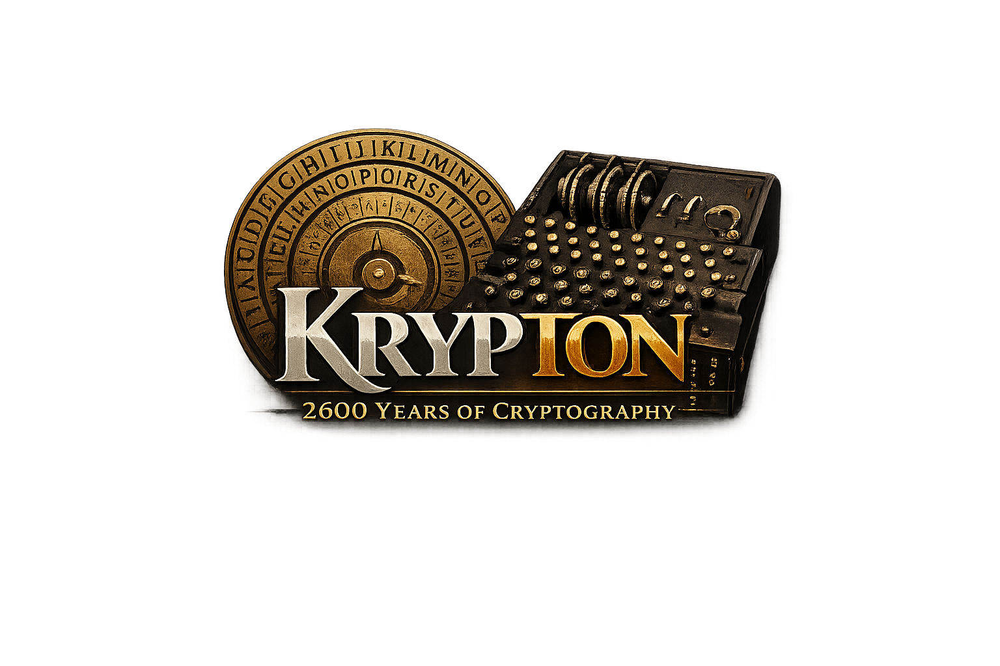

# krypton

[](https://en.wikipedia.org/wiki/C_(programming_language))
[](https://en.wikipedia.org/wiki/C99)
[](https://www.openssl.org/)
[](https://github.com/infosecm/krypton)
[](LICENSE)
[](https://sonarcloud.io/summary/new_code?id=infosecm_krypton)

**A multi-method file encryption, decryption, and hashing tool written in C.**

`krypton` supports 38 cipher methods spanning 2,600 years of cryptographic history — from the Spartan scytale of 600 BC to authenticated AES-GCM — as well as 11 one-way hash algorithms. It operates on any file type (text, binary, PDF, images, archives) and has zero dependencies beyond OpenSSL for its modern cipher backends.

---

## Table of Contents

- [Features](#features)
- [Building](#building)
  - [Linux](#linux)
  - [macOS](#macos)
  - [Windows](#windows)
- [Quick Start](#quick-start)
- [Usage](#usage)
- [Cipher Methods](#cipher-methods)
  - [Historical — Classical Antiquity](#historical--classical-antiquity)
  - [Historical — Renaissance](#historical--renaissance)
  - [Historical — 19th Century](#historical--19th-century)
  - [Historical — World War I](#historical--world-war-i)
  - [Historical — World War II](#historical--world-war-ii)
  - [Historical — Other 20th Century Ciphers](#historical--other-20th-century-ciphers)
  - [Modern Stream Ciphers (pure C)](#modern-stream-ciphers-pure-c)
  - [Modern Stream Ciphers (OpenSSL)](#modern-stream-ciphers-openssl)
  - [Legacy Block Ciphers (OpenSSL)](#legacy-block-ciphers-openssl)
  - [Block Ciphers — CBC Mode](#block-ciphers--cbc-mode)
  - [Block Ciphers — GCM Mode (Authenticated)](#block-ciphers--gcm-mode-authenticated)
- [Hash Algorithms](#hash-algorithms)
- [Key Derivation](#key-derivation)
- [Key Syntax Reference](#key-syntax-reference)
- [Algorithms Considered but Excluded](#algorithms-considered-but-excluded)
- [Security Notes](#security-notes)
- [Examples](#examples)
- [License](#license)

---

## Features

- **38 cipher methods** — from the Scytale (~600 BC) to AES-256-GCM
- **11 hash algorithms** — MD4, MD5, SHA-1, SHA-2 (224/256/384/512), SHA-3 (256/512), BLAKE2 (b/s)
- **Authenticated encryption** — AES-GCM and ChaCha20-Poly1305 detect any tampering at decryption time
- **Secure key derivation** — all OpenSSL ciphers use PBKDF2-HMAC-SHA256 (10 000 iterations + random salt)
- **Any file type** — operates on raw bytes; no format assumptions
- **Single C file** — ~2300 lines, no build system needed
- **Cross-platform** — Linux, macOS, and Windows (MSYS2, WSL2, or MSVC)
- **Historical accuracy** — Enigma simulation includes the authentic double-stepping anomaly and Wehrmacht rotor wirings

---

## Building

krypton depends on **OpenSSL 3.x** (libssl + libcrypto). The legacy algorithms (DES, Blowfish, CAST5, MD4) additionally require the OpenSSL **legacy provider** module, which krypton loads automatically at runtime — no extra compile flag is needed.

### Linux

**Debian / Ubuntu**
```bash
sudo apt install gcc libssl-dev
gcc -Wall -Wextra -o krypton krypton.c -lssl -lcrypto
```

**Fedora / RHEL / CentOS**
```bash
sudo dnf install gcc openssl-devel
gcc -Wall -Wextra -o krypton krypton.c -lssl -lcrypto
```

**Arch Linux**
```bash
sudo pacman -S gcc openssl
gcc -Wall -Wextra -o krypton krypton.c -lssl -lcrypto
```

**Ubuntu/Debian without `libssl-dev` but with Node.js installed**

If `libssl-dev` is not available, you can point the compiler at the OpenSSL headers that ship with Node.js:
```bash
gcc -Wall -Wextra -o krypton krypton.c \
    -I/usr/include/node \
    /usr/lib/x86_64-linux-gnu/libcrypto.so.3
```

**Legacy provider location (Linux)**
```
/usr/lib/x86_64-linux-gnu/ossl-modules/legacy.so   # Debian/Ubuntu
/usr/lib64/ossl-modules/legacy.so                   # Fedora/RHEL
```

---

### macOS

macOS ships **LibreSSL**, not OpenSSL. LibreSSL lacks several algorithms used by krypton. You must install the real OpenSSL via Homebrew.

**1. Install Homebrew** (if not already present)
```bash
/bin/bash -c "$(curl -fsSL https://raw.githubusercontent.com/Homebrew/install/HEAD/install.sh)"
```

**2. Install OpenSSL**
```bash
brew install openssl
```

**3. Compile**
```bash
gcc -Wall -Wextra -o krypton krypton.c \
    -I$(brew --prefix openssl)/include \
    -L$(brew --prefix openssl)/lib \
    -lssl -lcrypto
```

> **Tip:** if `brew --prefix openssl` returns nothing, run `brew list openssl` to confirm it is installed, then use the path printed by `brew info openssl`.

**Legacy provider location (macOS)**
```
$(brew --prefix openssl)/lib/ossl-modules/legacy.dylib
```

---

### Windows

There are three approaches. **MSYS2 is recommended** for most users.

#### Option A — MSYS2 / MinGW-w64 (recommended)

MSYS2 provides a full GCC toolchain and a native Windows build of OpenSSL. The resulting `.exe` runs on any Windows 10/11 machine once the required DLLs are placed in the same folder.

**1. Download and install MSYS2** from [https://www.msys2.org/](https://www.msys2.org/)

**2. Open the "MSYS2 UCRT64" shell** (Start → MSYS2 UCRT64) and install the toolchain:
```bash
pacman -Syu
pacman -S mingw-w64-ucrt-x86_64-gcc \
           mingw-w64-ucrt-x86_64-openssl
```

**3. Compile**
```bash
gcc -Wall -Wextra -o krypton.exe krypton.c -lssl -lcrypto
```

**4. Distribute** — to run `krypton.exe` on machines without MSYS2, copy these DLLs from `C:\msys64\ucrt64\bin\` into the same folder as the executable:
```
libssl-3-x64.dll
libcrypto-3-x64.dll
libgcc_s_seh-1.dll
libwinpthread-1.dll
```
You can find the full list with:
```bash
ldd krypton.exe | grep -v /c/Windows
```

**Legacy provider location (MSYS2)**
```
C:\msys64\ucrt64\lib\ossl-modules\legacy.dll
```
Copy this file alongside your executable if you intend to use DES, Blowfish, CAST5, or MD4.

---

#### Option B — WSL 2 (Windows Subsystem for Linux)

WSL 2 runs a real Linux kernel inside Windows. The Linux build instructions apply without modification.

**1. Install WSL 2** (PowerShell as Administrator, then restart):
```powershell
wsl --install
```
This installs Ubuntu by default.

**2. Open the Ubuntu shell**, then follow the [Linux instructions](#linux) above.

The compiled binary runs inside the WSL environment. You can call it from a Windows Terminal tab opened to the WSL session.

---

#### Option C — Visual Studio / MSVC (advanced)

A `strsep()` shim for the MSVC C runtime is already included in `krypton.c` inside an `#ifdef _WIN32` block.

**1. Install Visual Studio 2022** (Community edition is free):  
[https://visualstudio.microsoft.com/](https://visualstudio.microsoft.com/)  
Select the **"Desktop development with C++"** workload during setup.

**2. Install a pre-built OpenSSL for Windows** — choose one:
- [Win64 OpenSSL v3.x installer](https://slproweb.com/products/Win32OpenSSL.html) — install to e.g. `C:\OpenSSL-Win64`
- [vcpkg](https://vcpkg.io/) — `vcpkg install openssl:x64-windows`

**3. Open a "Developer Command Prompt for VS 2022"** and compile:
```bat
cl krypton.c ^
   /I "C:\OpenSSL-Win64\include" ^
   /link "C:\OpenSSL-Win64\lib\VC\x64\MD\libssl.lib" ^
         "C:\OpenSSL-Win64\lib\VC\x64\MD\libcrypto.lib" ^
   /out:krypton.exe
```

**4. Copy the OpenSSL runtime DLLs** next to `krypton.exe` (found in `C:\OpenSSL-Win64\bin\`):
```
libssl-3-x64.dll
libcrypto-3-x64.dll
```

**Legacy provider location (Windows / MSVC)**
```
C:\OpenSSL-Win64\lib\ossl-modules\legacy.dll
```

---

#### Legacy provider — all platforms

OpenSSL 3.x moved DES, Blowfish, CAST5, and MD4 into a separate **legacy provider** module. krypton loads it automatically at startup — no extra flag is needed when compiling or running. If the module file is absent, modern ciphers still work; only the legacy algorithms will report "not available in this OpenSSL build". The module ships with any standard OpenSSL 3.x installation.

---

## Quick Start

```bash
# Encrypt a file (best modern choice)
./krypton -e aes-256-gcm -k "my passphrase" -i secret.pdf -o secret.enc

# Decrypt it back
./krypton -d aes-256-gcm -k "my passphrase" -i secret.enc -o secret.pdf

# Hash a file
./krypton --hash sha256 -i firmware.bin

# Full help
./krypton -h
```

---

## Usage

```
./krypton -e <method>   -k <key> -i <input> -o <output>  # encrypt
./krypton -d <method>   -k <key> -i <input> -o <output>  # decrypt
./krypton --hash <alg>           -i <input> [-o <output>] # hash
./krypton -h                                               # help
```

| Flag | Description |
|---|---|
| `-e <method>` | Encrypt using the named cipher method |
| `-d <method>` | Decrypt using the same named cipher method |
| `--hash <alg>` | Compute a one-way hash (no key required) |
| `-k <key>` | Passphrase or key (format varies per method — see below) |
| `-i <file>` | Input file (any type) |
| `-o <file>` | Output file (required for ciphers; optional for hash — saves hex) |
| `-h` / `--help` | Print full help with all methods and examples |

---

## Cipher Methods

### Historical — Classical Antiquity

#### `scytale` — Scytale Cipher (~700 BC)

The scytale is the oldest known cryptographic *device* — predating every other cipher in this program by at least a century. Used by the Spartans for military communications as early as the 7th century BC, it consisted of a strip of leather or parchment wound helically around a cylindrical wooden staff (the skytale). A message was written lengthwise along the staff; when the strip was unwound, the letters appeared in a scrambled, unreadable order. Only a recipient possessing a staff of precisely the same diameter could decode the message by rewinding the strip. The Spartan general Lysander is said to have used one to receive a message warning of a Persian attack in 405 BC. In modern terms, it is a pure columnar transposition cipher where the key is the number of columns (the staff's circumference in characters).

- **Key:** integer column-width ≥ 2 (e.g. `-k "4"`)
- **Handles:** all byte values; no characters are discarded
- **Self-inverse:** no — use `-d` to decrypt

```bash
./krypton -e scytale -k "4" -i plain.txt -o cipher.txt
./krypton -d scytale -k "4" -i cipher.txt -o plain.txt
```

---

#### `atbash` — Atbash Cipher (~600 BC)

The Atbash cipher originates in ancient Hebrew scribal tradition and is one of the oldest known substitution ciphers. It is found in the Hebrew Bible, most notably in the Book of Jeremiah, where the word "Sheshach" is believed to be a coded form of "Babel." The cipher simply reverses the alphabet — A becomes Z, B becomes Y, and so forth — making it its own inverse: the same operation both encrypts and decrypts.

- **Key:** none — use `-k ""`
- **Self-inverse:** yes
- **Handles:** upper and lowercase letters; all other bytes pass through unchanged

```bash
./krypton -e atbash -k "" -i plain.txt -o cipher.txt
./krypton -d atbash -k "" -i cipher.txt -o plain.txt
```

---

#### `affine` — Affine Cipher (Antiquity, precise date unknown)

The affine cipher is a generalisation of the Caesar cipher that uses modular arithmetic to encrypt each letter: `C = (a × P + b) mod 26`. The multiplier `a` introduces a multiplicative component absent from Caesar, making the cipher slightly stronger — there are 312 possible key pairs rather than just 25 shifts. The cipher was analysed extensively by Arab mathematicians such as al-Kindi (c. 801–873 AD), whose treatise *On Deciphering Cryptographic Messages* is the earliest known work on frequency analysis and cryptanalysis. The additive component `b` is identical to a Caesar shift; when `a = 1`, the affine cipher reduces exactly to Caesar.

- **Key:** `"a,b"` where `a` must be coprime to 26 (e.g. `-k "7,3"`)
- **Valid `a` values:** 1 3 5 7 9 11 15 17 19 21 23 25
- **Handles:** letters only; all other bytes pass through unchanged

```bash
./krypton -e affine -k "7,3" -i plain.txt -o cipher.txt
./krypton -d affine -k "7,3" -i cipher.txt -o plain.txt
```

---

#### `polybe` — Polybius Square (~200 BC)

The Polybius square was described by the Greek historian Polybius around 150 BC as a system for encoding letters as pairs of numbers using a 5×5 grid. It became the foundation for many later ciphers and was still in use during World War I as the basis for the ADFGVX cipher. In prison culture, it survived as the "tap code" — used by POWs to communicate by tapping on walls during both World War II and the Vietnam War.

- **Key:** none — use `-k ""`
- **Grid:** standard 5×5, I and J share the same cell
- **Output:** pairs of digits 1–5 separated by spaces (larger than input)
- **Note:** `-e` encodes text to digit pairs; `-d` decodes back to letters

```bash
./krypton -e polybe -k "" -i plain.txt -o encoded.txt
./krypton -d polybe -k "" -i encoded.txt -o plain.txt
```

---

#### `caesar` — Caesar Cipher (~50 BC)

Named after Julius Caesar, who used it to protect his military correspondence, this cipher shifts each byte of the input by a fixed integer value modulo 256. Suetonius documented Caesar's use of a shift of three in his *Lives of the Twelve Caesars*. Although trivially broken today — there are only 255 possible keys — it remained the cipher of choice for centuries and is the conceptual ancestor of every modern stream cipher. It also introduced the idea of a secret numerical key, separate from the algorithm itself.

- **Key:** integer shift 0–255 (e.g. `-k "13"`)
- **Operates on:** raw bytes (not just letters)

```bash
./krypton -e caesar -k "13" -i plain.txt -o cipher.txt
./krypton -d caesar -k "13" -i cipher.txt -o plain.txt
```

---

### Historical — Renaissance

#### `trithemius` — Trithemius Cipher (Johannes Trithemius, 1508)

Johannes Trithemius, a German abbot and scholar, published *Polygraphia* in 1508 — the first printed book ever devoted to cryptography. His cipher advances letter by letter through the rows of the *tabula recta* (a 26×26square of Caesar shifts), so the first letter is shifted by 0, the second by 1, the third by 2, and so on, cycling back to 0 after 26. This auto-key progressive shift makes it a precursor of the Vigenère cipher: Vigenère's key is a repeating password, whereas Trithemius's "key" is the position itself. Trithemius concealed his own work within it — his book *Steganographia* (1499), ostensibly a treatise on spirit magic, was actually a cryptography manual encoded using his own system, not recognised as such until 1606.

- **Key:** none — use `-k ""`
- **Handles:** letters only; all other bytes pass through unchanged

```bash
./krypton -e trithemius -k "" -i plain.txt -o cipher.txt
./krypton -d trithemius -k "" -i cipher.txt -o plain.txt
```

---

#### `vigenere` — Vigenère Cipher (1553)

Although named after the French diplomat Blaise de Vigenère, this polyalphabetic cipher was actually first described by Giovan Battista Bellaso in 1553. For three centuries it was known as *le chiffre indéchiffrable* (the indecipherable cipher), until Charles Babbage quietly cracked it in the 1840s (though he never published his method) and Friedrich Kasiski independently published a full attack in 1863. By applying a repeating keyword to shift each letter by a different amount, it defeats simple frequency analysis — the most powerful cryptanalytic technique of its era.

- **Key:** alphabetic string, a–z or A–Z (e.g. `-k "lemon"`)
- **Handles:** letters only; non-alphabetic bytes pass through unchanged

```bash
./krypton -e vigenere -k "lemon" -i plain.txt -o cipher.txt
./krypton -d vigenere -k "lemon" -i cipher.txt -o plain.txt
```

---

#### `porta` — Porta Cipher (Giovanni Battista della Porta, 1563)

Giovanni Battista della Porta, a Neapolitan polymath, published *De Furtivis Literarum Notis* in 1563 — the first book dedicated entirely to cryptanalysis rather than simply to cipher construction. His cipher uses a 13-row reciprocal substitution table: each pair of keyword letters selects a row, which maps the first half of the alphabet (A–M) to a scrambled version of the second half (N–Z), and vice versa. Because the same table is used in both directions, encryption and decryption are identical operations — the cipher is self-inverse. Porta also made early contributions to the camera obscura and to natural magic, writing the encyclopaedic *Magia Naturalis* (1558).

- **Key:** any alphabetic string (e.g. `-k "secret"`)
- **Self-inverse:** yes — the same key and `-e` flag decrypts
- **Handles:** letters only; all other bytes pass through unchanged

```bash
./krypton -e porta -k "secret" -i plain.txt -o cipher.txt
./krypton -e porta -k "secret" -i cipher.txt -o plain.txt  # same command decrypts
```

---

#### `bacon` — Bacon's Cipher (Francis Bacon, 1605)

Sir Francis Bacon, the English philosopher and statesman, devised this binary steganographic cipher in 1605 and described it in his work *De Augmentis Scientiarum*. Each letter of the alphabet is encoded as a sequence of five binary symbols — Bacon used two typefaces (A and B) to hide messages inside ordinary text. While not strong by modern standards, it is one of the earliest examples of steganography and of a binary encoding scheme, anticipating the conceptual foundations of digital communication by over 300 years.

- **Key:** none — use `-k ""`
- **Output:** groups of five A/B characters, one group per input letter (larger than input)
- **Note:** `-e` encodes letters to A/B groups; `-d` decodes back

```bash
./krypton -e bacon -k "" -i plain.txt -o bacon.txt
./krypton -d bacon -k "" -i bacon.txt -o plain.txt
```

---

### Historical — 19th Century

#### `playfair` — Playfair Cipher (1854)

Invented by Charles Wheatstone in 1854 and named after his friend Lord Playfair who promoted its adoption, this was the first practical digraph cipher — encrypting pairs of letters rather than individual characters, which significantly complicates frequency analysis. The British Army used it extensively during the Boer War and World War I; a famous use was in the Pacific theatre during World War II when it was used to send the message that rescued a young Lt. John F. Kennedy and his PT-109 crew in 1943.

- **Key:** any keyword used to build the 5×5 key square (e.g. `-k "monarchy"`)
- **Note:** J is treated as I; X is inserted between repeated letter pairs and as end-padding per the original specification; input must be alphabetic

```bash
./krypton -e playfair -k "monarchy" -i plain.txt -o cipher.txt
./krypton -d playfair -k "monarchy" -i cipher.txt -o plain.txt
```

---

#### `beaufort` — Beaufort Cipher (Admiral Sir Francis Beaufort, 1857)

Admiral Sir Francis Beaufort — better known today for the Beaufort wind scale he devised in 1805 — also created a cipher variant that became a favourite of the British Royal Navy. The Beaufort cipher is a close cousin of Vigenère, but with the encryption formula reversed: `C = (K − P) mod 26` instead of Vigenère's `C = (P + K) mod 26`. This small change makes the cipher self-inverse: the same keyword and same operation decrypt whatever they encrypted, an operationally useful property for field use. Ian Fleming paid tribute to its naval heritage by having James Bond use a Beaufort cipher in *From Russia with Love* (1957).

- **Key:** alphabetic string, a–z or A–Z (e.g. `-k "royalnavy"`)
- **Self-inverse:** yes — `-e` with the same key decrypts
- **Handles:** letters only; all other bytes pass through unchanged

```bash
./krypton -e beaufort -k "royalnavy" -i plain.txt -o cipher.txt
./krypton -e beaufort -k "royalnavy" -i cipher.txt -o plain.txt  # same command decrypts
```

---

#### `railfence` — Rail Fence Cipher (US Civil War era, ~1860s)

The Rail Fence cipher is a transposition cipher that writes the plaintext in a zigzag pattern across a number of imaginary "rails," then reads the ciphertext off row by row. It was used by both Union and Confederate forces during the American Civil War for field communications, valued for its simplicity — it required no special equipment, just pen and paper. Unlike substitution ciphers, it changes the *position* of characters rather than their identity, making it resistant to frequency analysis but easily broken once the technique is known.

- **Key:** integer number of rails ≥ 2 (e.g. `-k "3"`)
- **Handles:** all byte values; no characters are discarded

```bash
./krypton -e railfence -k "3" -i plain.txt -o cipher.txt
./krypton -d railfence -k "3" -i cipher.txt -o plain.txt
```

---

### Historical — World War I

#### `adfgvx` — ADFGVX Cipher (German Army, March 1918)

Introduced by the German Army in March 1918, just weeks before their Spring Offensive, ADFGVX was one of the most sophisticated field ciphers of its era. It combined a 6×6 Polybius square (covering A–Z and 0–9) with a columnar transposition step, making it resistant to both frequency analysis and pattern attacks. The six output letters — A, D, F, G, V, X — were chosen because their Morse code representations are very distinct, reducing transcription errors over radio. French cryptanalyst Georges Painvin broke the cipher in June 1918, a feat considered one of the greatest achievements in the history of cryptanalysis.

- **Key:** `"SUBKEY:TRANSKEY"` where SUBKEY builds the 6×6 grid and TRANSKEY drives the columnar transposition (e.g. `-k "DEUTSCH:ANGRIFF"`)
- **Output characters:** exclusively from the set `{A, D, F, G, V, X}`
- **Handles:** letters A–Z and digits 0–9; other characters are discarded

```bash
./krypton -e adfgvx -k "DEUTSCH:ANGRIFF" -i plain.txt -o cipher.txt
./krypton -d adfgvx -k "DEUTSCH:ANGRIFF" -i cipher.txt -o plain.txt
```

---

#### `columnar` — Columnar Transposition Cipher (WWI / WWII)

The columnar transposition cipher writes plaintext row by row into a grid of columns, then reads the columns out in the alphabetical order of a keyword. It was a workhorse cipher of the early 20th century: the French Army used it as their primary field cipher in the opening months of World War I, and it later formed the transposition half of both the ADFGVX cipher and the American ADFGX cipher. Germany, Britain, and the United States all used variants of columnar transposition in both wars, sometimes layered (see `double` below) for greater security. The cipher is fully general: it handles all byte values and any input length.

- **Key:** any alphabetic keyword, minimum 2 characters (e.g. `-k "ZEBRAS"`)
- **Handles:** all byte values; no characters are discarded

```bash
./krypton -e columnar -k "ZEBRAS" -i plain.txt -o cipher.txt
./krypton -d columnar -k "ZEBRAS" -i cipher.txt -o plain.txt
```

---

### Historical — World War II

#### `double` — Double Transposition Cipher (SOE / Allied WWII Field Cipher)

The double transposition cipher is simply two successive rounds of columnar transposition, each using an independent keyword. What makes this combination powerful is that it is vastly harder to break than a single transposition: an attacker cannot work backward from the ciphertext without first guessing both keys independently, and the interaction between the two permutations resists the standard anagramming attacks used against single columnar. The British Special Operations Executive (SOE) taught this cipher to resistance agents parachuted into occupied France, Belgium, and the Netherlands from 1940 onwards. Agents memorised two keywords — often drawn from a line of poetry or a nursery rhyme — and used them as their only means of secure communication with London. The cipher was considered operationally unbreakable in the field without machine assistance, which the German Gestapo lacked for most of the war.

- **Key:** `"KEY1:KEY2"` — two independent keywords (e.g. `-k "SECURITY:LONDON"`)
- **Handles:** all byte values; no characters are discarded

```bash
./krypton -e double -k "SECURITY:LONDON" -i plain.txt -o cipher.txt
./krypton -d double -k "SECURITY:LONDON" -i cipher.txt -o plain.txt
```

---

#### `enigma` — Enigma Machine Simulation (1923–1945)

The Enigma machine is arguably the most famous cipher device in history. Invented by German engineer Arthur Scherbius in 1918 and patented in 1923, it was adopted by the German military in the late 1920s and became the backbone of Nazi communications throughout World War II. Its polyalphabetic substitution — driven by a series of rotating wheels, a reflector, and a plugboard — produced an astronomically large key space that German cryptographers believed was unbreakable. The Allied effort to crack it, led by Alan Turing and his colleagues at Bletchley Park (drawing on earlier work by Polish mathematicians Marian Rejewski, Jerzy Różycki, and Henryk Zygalski), is credited with shortening the war by an estimated two to four years.

This implementation is a faithful simulation of the Wehrmacht/Luftwaffe Enigma with the following characteristics:
- **Five rotor choices:** I, II, III, IV, V with historically correct wirings
- **Reflector:** B (Umkehrwalze B)
- **Plugboard (Steckerbrett):** up to 13 cable pairs
- **Double-stepping anomaly:** the authentic mechanical quirk of the real machine is reproduced
- **Self-inverse:** encrypting ciphertext with the same settings yields the original plaintext

> **Key format:** `"R1:R2:R3:POS:PAIRS"`
> - `R1 R2 R3` = rotor identifiers left to right: `I` `II` `III` `IV` `V`
> - `POS` = 3-letter start positions (e.g. `AAA` or `XKZ`)
> - `PAIRS` = plugboard pairs, space-separated (e.g. `AB CD EF`) — omit or leave empty for no plugboard

```bash
# No plugboard
./krypton -e enigma -k "I:II:III:AAA:" -i msg.txt -o msg.enc

# With plugboard (self-inverse — same command decrypts)
./krypton -e enigma -k "IV:I:V:XKZ:AB CD EF GH" -i msg.enc -o msg.dec
```

---

### Historical — Other 20th Century Ciphers

#### `foursquare` — Four-Square Cipher (Félix Delastelle, 1901)

Félix Delastelle was a French amateur cryptographer who, working entirely outside academic institutions, invented three elegant ciphers at the turn of the 20th century: the bifid, the trifid, and the four-square. The four-square cipher uses four 5×5 Playfair-like key squares arranged in a two-by-two layout. The top-left and bottom-right squares hold the standard plain alphabet (with I=J); the top-right and bottom-left squares are keyed from two separate keywords. To encrypt a digraph (P1, P2), locate P1 in the top-left square and P2 in the bottom-right square; the ciphertext pair is read from the top-right square at the row of P1 and column of P2, and from the bottom-left square at the row of P2 and column of P1. Using two independent keywords gives the four-square cipher considerably more resistance to frequency analysis than single-keyword ciphers.

- **Key:** `"KEY1:KEY2"` — two separate keywords (e.g. `-k "EXAMPLE:KEYWORD"`)
- **Handles:** alphabetic characters only; J is treated as I; odd-length input is padded with X

```bash
./krypton -e foursquare -k "EXAMPLE:KEYWORD" -i plain.txt -o cipher.txt
./krypton -d foursquare -k "EXAMPLE:KEYWORD" -i cipher.txt -o plain.txt
```

---

#### `vernam` — Vernam Cipher / One-Time Pad (Gilbert Vernam, 1917)

Gilbert Vernam, an AT&T Bell Labs engineer, patented the teletype cipher that bears his name in 1919. When Claude Shannon proved in his landmark 1949 paper *Communication Theory of Secrecy Systems* that a one-time pad is the only cipher that is **information-theoretically secure** — unbreakable even with unlimited computing power — the Vernam cipher became the gold standard of theoretical cryptography. The KGB used one-time pads for their most sensitive communications throughout the Cold War. The cipher's fatal weakness is entirely operational: the key must be truly random, at least as long as the message, and must *never* be reused. The catastrophic Soviet VENONA failures of the 1940s stemmed entirely from key reuse under wartime production pressure.

- **Key:** `@/path/to/keyfile` — a binary file at least as large as the input
- **Self-inverse:** yes — the same key file both encrypts and decrypts
- **⚠️ Warning:** never reuse a key file; doing so completely breaks security

```bash
# Generate a key (Linux / macOS / WSL)
dd if=/dev/urandom of=mykey.bin bs=1 count=$(wc -c < secret.txt)

./krypton -e vernam -k "@mykey.bin" -i secret.txt -o secret.enc
./krypton -d vernam -k "@mykey.bin" -i secret.enc -o secret.txt
```

---

#### `rot13` — ROT13 (~1980s, Usenet)

ROT13 is a degenerate special case of the Caesar cipher with a shift of 13 — chosen because 13 is half the 26-letter alphabet, making the cipher self-inverse. It rose to prominence on Usenet newsgroups in the early 1980s as a lightweight way to hide spoilers, punchlines, and potentially offensive content. It remains one of the most widely recognised toy ciphers and a rite of passage in computing culture.

- **Key:** none — use `-k ""`
- **Self-inverse:** yes
- **Handles:** letters only; all other bytes pass through unchanged

```bash
./krypton -e rot13 -k "" -i plain.txt -o rotated.txt
```

---

#### `rot47` — ROT47 (~1990s, Usenet)

ROT47 extends the logic of ROT13 to the full set of 94 printable ASCII characters — everything from `!` (0x21) to `~` (0x7E). Each character is rotated forward 47 positions within that range, wrapping around, which makes the operation self-inverse (applying it twice yields the original). It was used on Usenet in the same spirit as ROT13, but for contexts where non-alphabetic characters — source code, URLs, punctuation — needed to be obscured alongside the text. Being self-inverse, it also became popular as a simple reversible text scrambler in many programming exercises.

- **Key:** none — use `-k ""`
- **Self-inverse:** yes
- **Handles:** all 94 printable ASCII characters (0x21–0x7E); bytes outside this range pass through unchanged

```bash
./krypton -e rot47 -k "" -i plain.txt -o scrambled.txt
```

---

### Modern Stream Ciphers (pure C)

#### `xor` — XOR Cipher

The XOR (exclusive-or) cipher applies a repeating key stream to the input using the bitwise XOR operation. It is the conceptual skeleton underlying every modern stream cipher — ChaCha20, RC4, and the Vernam pad all reduce to XOR at their core. As a standalone cipher with a short, repeating key it offers negligible security (a known-plaintext attack recovers the key immediately), but it is fast, dependency-free, and useful for quick obfuscation or as an educational baseline.

- **Key:** any non-empty string (cycles repeatedly over the input)
- **Self-inverse:** yes

```bash
./krypton -e xor -k "MySecret" -i file.bin -o file.enc
./krypton -d xor -k "MySecret" -i file.enc -o file.bin
```

---

#### `rc4` — RC4 Stream Cipher (Ron Rivest, 1987)

RC4 (Rivest Cipher 4) was designed by Ron Rivest at RSA Security in 1987 and kept as a trade secret until it was anonymously posted to the Cypherpunks mailing list in 1994. It became the most widely deployed stream cipher in history, used in WEP, WPA, SSL/TLS, and Microsoft Office encryption. However, statistical biases in its output — particularly in the first few bytes of the keystream — have been thoroughly documented since 2001 (the Fluhrer-Mantin-Shamir attack against WEP). RC4 was formally prohibited in TLS by RFC 7465 in 2015. It is included here for legacy compatibility and educational purposes.

- **Key:** any string up to 256 characters
- **Self-inverse:** yes

```bash
./krypton -e rc4 -k "P@ssw0rd" -i file.bin -o file.enc
./krypton -d rc4 -k "P@ssw0rd" -i file.enc -o file.bin
```

---

### Modern Stream Ciphers (OpenSSL)

#### `chacha20` — ChaCha20 (Daniel J. Bernstein, 2008)

ChaCha20 was designed by Daniel J. Bernstein in 2008 as an evolution of his earlier Salsa20 cipher, with improved diffusion properties. Google adopted it for HTTPS traffic between Chrome and its servers in 2013, after research showed that AES was significantly slower on devices that lack hardware AES acceleration. It was standardised in RFC 7539 (2015) and is now one of the two mandatory cipher suites in TLS 1.3. ChaCha20 is a pure software design with no lookup tables, making it inherently resistant to cache-timing attacks.

- **Key:** any passphrase (derived to 256-bit via PBKDF2-SHA256 + random salt)
- **Mode:** unauthenticated — provides confidentiality only

```bash
./krypton -e chacha20 -k "passphrase" -i video.mp4 -o video.enc
./krypton -d chacha20 -k "passphrase" -i video.enc -o video.mp4
```

---

#### `chacha20-poly1305` — ChaCha20-Poly1305 (AEAD) ⭐

ChaCha20-Poly1305 pairs the ChaCha20 stream cipher with the Poly1305 message authentication code (also designed by Bernstein). Together they form an AEAD (Authenticated Encryption with Associated Data) construction that provides both confidentiality and integrity in a single pass. Standardised in RFC 8439, it is mandatory in TLS 1.3 alongside AES-GCM and is the recommended cipher for systems without AES hardware acceleration.

- **Key:** any passphrase
- **Authenticated:** decryption fails with an explicit error if the file was tampered with
- **File format:** `[16-byte salt][12-byte nonce][ciphertext][16-byte auth tag]`

```bash
./krypton -e chacha20-poly1305 -k "passphrase" -i doc.pdf -o doc.enc
./krypton -d chacha20-poly1305 -k "passphrase" -i doc.enc -o doc.pdf
```

---

### Legacy Block Ciphers (OpenSSL)

These three ciphers are provided for interoperability with legacy systems and for educational purposes. They are backed by the OpenSSL **legacy provider**, which krypton loads automatically. All use CBC mode with PKCS#7 padding and PBKDF2-SHA256 key derivation.

> ⚠️ **Do not use these for new systems.** See the security notes for each.

---

#### `des` — DES (Data Encryption Standard, 1977) ⚠️ BROKEN

The Data Encryption Standard was adopted by NIST in 1977 with a 56-bit key — a length already considered dangerously short by some cryptographers at the time. The NSA is widely believed to have deliberately limited the key size from the 64-bit length originally proposed by IBM. By the late 1990s, dedicated hardware (the EFF's "Deep Crack" machine) could exhaust the entire DES key space in under 24 hours. DES was officially withdrawn by NIST in 2005. It is included here **for historical and educational purposes only** — it offers no meaningful security against a modern adversary.

- **Key:** any passphrase
- **⛔ Security status:** cryptographically broken — 56-bit key, brute-forceable in hours

```bash
./krypton -e des -k "legacykey" -i file.bin -o file.enc
./krypton -d des -k "legacykey" -i file.enc -o file.bin
```

---

#### `blowfish` — Blowfish (Bruce Schneier, 1993) ⚠️ Legacy

Blowfish was designed by Bruce Schneier in 1993 as a fast, free alternative to DES and IDEA. For over a decade it was one of the most popular symmetric ciphers, widely used in password hashing (bcrypt still uses it internally), SSH implementations, and file encryption tools. Its 64-bit block size makes it theoretically susceptible to the **SWEET32 birthday attack** (demonstrated in 2016 against long-lived HTTPS sessions using 3DES and Blowfish). Schneier himself has recommended moving to its successor Twofish or to AES. Blowfish supports variable key lengths from 32 to 448 bits.

- **Key:** any passphrase
- **⚠️ Security status:** legacy — 64-bit block size, SWEET32 risk in long sessions

```bash
./krypton -e blowfish -k "passphrase" -i file.bin -o file.enc
./krypton -d blowfish -k "passphrase" -i file.enc -o file.bin
```

---

#### `cast5` — CAST5 / CAST-128 (Carlisle Adams & Stafford Tavares, 1996) ⚠️ Legacy

CAST5 (also known as CAST-128) was designed by Carlisle Adams and Stafford Tavares and standardised in RFC 2144 (1997). It was the default cipher in early versions of PGP and GnuPG, and was included in many SSH and TLS implementations throughout the 2000s. Like Blowfish, its 64-bit block size makes it vulnerable to the SWEET32 birthday attack over large volumes of data encrypted under the same key. CAST5 supports key sizes from 40 to 128 bits.

- **Key:** any passphrase
- **⚠️ Security status:** legacy — 64-bit block size, SWEET32 risk in long sessions

```bash
./krypton -e cast5 -k "passphrase" -i file.bin -o file.enc
./krypton -d cast5 -k "passphrase" -i file.enc -o file.bin
```

---

### Block Ciphers — CBC Mode

All CBC-mode ciphers below use the following scheme:
- Key derivation: **PBKDF2-HMAC-SHA256**, 10 000 iterations, random 16-byte salt
- Padding: **PKCS#7**
- Salt is automatically prepended to the output and read back transparently on decryption
- Provides **confidentiality only** — does not detect tampering

---

#### `3des` — Triple-DES (3DES-EDE-CBC) ⚠️ Legacy

The original Data Encryption Standard (DES) was adopted by NIST in 1977 with a 56-bit key. By the late 1990s, dedicated hardware could brute-force a DES key in under 24 hours. Triple-DES was the stopgap solution: applying DES three times with two or three independent keys, extending the effective key length to 112 or 168 bits. It powered online banking and payment systems worldwide for decades. NIST deprecated 3DES in 2019 and disallowed it entirely in 2023.

- **Key:** any passphrase

```bash
./krypton -e 3des -k "legacykey" -i data.bin -o data.enc
./krypton -d 3des -k "legacykey" -i data.enc -o data.bin
```

---

#### `camellia-128` / `camellia-256` — Camellia CBC

Camellia was designed jointly by Mitsubishi Electric and NTT in 2000. It was selected as a recommended cipher by the NESSIE project (Europe) in 2003, standardised by ISO/IEC 18033-3, and approved for use in TLS by RFC 4132. It was designed as a drop-in alternative to AES with equivalent security properties and comparable performance, and is the cipher of choice in Japan for government and financial systems.

- **Key:** any passphrase

```bash
./krypton -e camellia-256 -k "passphrase" -i file.bin -o file.enc
./krypton -d camellia-256 -k "passphrase" -i file.enc -o file.bin
```

---

#### `aria-128` / `aria-256` — ARIA CBC

ARIA was designed by a team of Korean cryptographers in 2003 and adopted as the Korean national encryption standard (KS X 1213) in 2004. Its name stands for *Academy, Research Institute, and Agency*, reflecting the collaboration between Korean universities, the Korea Internet & Security Agency (KISA), and government bodies. It is mandatory in Korean government and financial systems.

- **Key:** any passphrase

```bash
./krypton -e aria-256 -k "passphrase" -i file.bin -o file.enc
./krypton -d aria-256 -k "passphrase" -i file.enc -o file.bin
```

---

#### `sm4` — SM4 CBC

SM4 (previously known as SMS4) is a block cipher published by the Chinese government in 2006 and standardised as GB/T 32907-2016. It was originally developed for WLAN security in China and is now the mandatory encryption algorithm for Chinese government systems, financial institutions, and 5G network infrastructure. It was included in ISO/IEC 18033-3 in 2021.

- **Key:** any passphrase

```bash
./krypton -e sm4 -k "passphrase" -i file.bin -o file.enc
./krypton -d sm4 -k "passphrase" -i file.enc -o file.bin
```

---

#### `aes-128` / `aes-192` / `aes-256` — AES CBC

The Advanced Encryption Standard was selected by NIST in 2001 following a five-year public competition. The winner, Rijndael (designed by Belgian cryptographers Joan Daemen and Vincent Rijmen), was adopted as FIPS 197. AES rapidly became the universal standard for symmetric encryption, embedded in hardware across virtually every computing device manufactured since 2010. It is used to protect classified US government information up to TOP SECRET level and is the backbone of TLS, disk encryption, and VPN protocols worldwide.

- **Key:** any passphrase
- **Recommended:** `aes-256` for new systems

```bash
./krypton -e aes-256 -k "passphrase" -i file.bin -o file.enc
./krypton -d aes-256 -k "passphrase" -i file.enc -o file.bin
```

---

### Block Ciphers — GCM Mode (Authenticated)

#### `aes-128-gcm` / `aes-192-gcm` / `aes-256-gcm` — AES-GCM ⭐

Galois/Counter Mode (GCM) transforms AES into an authenticated encryption scheme by combining CTR-mode encryption with a GHASH-based message authentication code. The result is an AEAD construction: a single key and operation provide both confidentiality and integrity. Any modification to the ciphertext — even flipping a single bit — is detected at decryption time with a cryptographic guarantee. GCM was standardised by NIST in 2007 and is now mandatory in TLS 1.3, IPsec, and SSH.

- **Key:** any passphrase
- **File format:** `[16-byte salt][12-byte nonce][ciphertext][16-byte auth tag]`
- **Authenticated:** any tampering causes decryption to fail with `Authentication FAILED`
- **Recommended:** `aes-256-gcm` for the strongest security

```bash
./krypton -e aes-256-gcm -k "passphrase" -i secret.pdf -o secret.enc
./krypton -d aes-256-gcm -k "passphrase" -i secret.enc -o secret.pdf
```

---

## Hash Algorithms

Hash mode computes a one-way digest and prints the hex string to stdout. Optionally saves the result to a file with `-o`. No key is required.

```bash
./krypton --hash sha256 -i firmware.bin
./krypton --hash blake2b -i archive.tar.gz -o archive.b2sum
```

### Legacy ⚠️

| Algorithm | Flag | Output | Notes |
|---|---|---|---|
| MD4 | `md4` | 128-bit / 32 hex chars | Ron Rivest, 1990. Predecessor of MD5; still used internally by Windows NTLM/NTHash. Cryptographically broken. Requires OpenSSL legacy provider (loaded automatically). |
| MD5 | `md5` | 128-bit / 32 hex chars | Ron Rivest, 1992. Collision attacks practical since 2004. For compatibility only. |
| SHA-1 | `sha1` or `sha` | 160-bit / 40 hex chars | NIST, 1995. Collision demonstrated by Google's SHAttered attack (2017). Deprecated. `sha` is accepted as an alias. SHA-0 (the withdrawn 1993 original) is not available in modern OpenSSL builds. |

### SHA-2 Family (NIST FIPS 180-4)

| Algorithm | Flag | Output | Notes |
|---|---|---|---|
| SHA-224 | `sha224` | 224-bit / 56 hex chars | Truncated variant of SHA-256. |
| SHA-256 | `sha256` | 256-bit / 64 hex chars | Recommended for general use. |
| SHA-384 | `sha384` | 384-bit / 96 hex chars | Truncated variant of SHA-512. |
| SHA-512 | `sha512` | 512-bit / 128 hex chars | Faster than SHA-256 on 64-bit systems. |

### SHA-3 Family (NIST FIPS 202 — Keccak)

SHA-3 is based on the Keccak sponge construction, designed by Guido Bertoni, Joan Daemen, Michaël Peeters, and Gilles Van Assche. Selected in 2012 as the winner of NIST's open SHA-3 competition. Unlike SHA-2 (a Merkle–Damgård construction), SHA-3 is structurally unrelated, providing algorithmic diversity.

| Algorithm | Flag | Output |
|---|---|---|
| SHA3-256 | `sha3-256` | 256-bit / 64 hex chars |
| SHA3-512 | `sha3-512` | 512-bit / 128 hex chars |

### BLAKE2 Family

BLAKE2 was designed by Jean-Philippe Aumasson, Samuel Neves, Zooko Wilcox-O'Hearn, and Christian Winnerlein in 2012 as a faster alternative to MD5 and SHA-2, while remaining cryptographically secure. Used by password managers, file integrity checkers, and the WireGuard VPN protocol.

| Algorithm | Flag | Output | Notes |
|---|---|---|---|
| BLAKE2b | `blake2b` | 512-bit / 128 hex chars | Optimised for 64-bit platforms |
| BLAKE2s | `blake2s` | 256-bit / 64 hex chars | Optimised for 32-bit and embedded platforms |

---

## Key Derivation

All OpenSSL-backed cipher methods derive a cryptographic key from your passphrase using **PBKDF2-HMAC-SHA256**:

1. A **16-byte random salt** is generated at encryption time using `RAND_bytes()`
2. PBKDF2 is applied with **10 000 iterations** to derive the cipher key
3. A second PBKDF2 call (with a modified salt) derives the IV
4. The salt is **automatically prepended** to the output file
5. On decryption, the salt is read from the file header and the same derivation is repeated

This means two encryptions of the same file with the same passphrase produce different ciphertext — brute-forcing the passphrase requires 10 000 hash computations per guess.

For GCM-mode ciphers, a **12-byte random nonce** is also generated and stored in the file header, followed by the ciphertext and a **16-byte authentication tag**.

---

## Key Syntax Reference

| Method | Key format | Example |
|---|---|---|
| `scytale` | Integer ≥ 2 | `-k "4"` |
| `atbash` | None | `-k ""` |
| `affine` | `"a,b"` (a coprime to 26) | `-k "7,3"` |
| `polybe` | None | `-k ""` |
| `trithemius` | None | `-k ""` |
| `porta` | Alpha string | `-k "secret"` |
| `bacon` | None | `-k ""` |
| `caesar` | Integer 0–255 | `-k "13"` |
| `vigenere` | Alpha string | `-k "lemon"` |
| `beaufort` | Alpha string | `-k "royalnavy"` |
| `rot13` | None | `-k ""` |
| `rot47` | None | `-k ""` |
| `playfair` | Any keyword | `-k "monarchy"` |
| `foursquare` | `"KEY1:KEY2"` | `-k "EXAMPLE:KEYWORD"` |
| `railfence` | Integer ≥ 2 | `-k "3"` |
| `columnar` | Any keyword | `-k "ZEBRAS"` |
| `adfgvx` | `"SUBKEY:TRANSKEY"` | `-k "DEUTSCH:ANGRIFF"` |
| `double` | `"KEY1:KEY2"` | `-k "SECURITY:LONDON"` |
| `enigma` | `R1:R2:R3:POS:PAIRS` | `-k "I:II:III:AAA:AB CD"` |
| `vernam` | `@/path/to/keyfile` | `-k "@/secure/pad.bin"` |
| `xor` | Any string | `-k "MySecret"` |
| `rc4` | Any string ≤ 256 chars | `-k "P@ssw0rd"` |
| `chacha20` | Any passphrase | `-k "my pass"` |
| `chacha20-poly1305` | Any passphrase | `-k "my pass"` |
| `des` | Any passphrase | `-k "my pass"` |
| `blowfish` | Any passphrase | `-k "my pass"` |
| `cast5` | Any passphrase | `-k "my pass"` |
| `3des` | Any passphrase | `-k "my pass"` |
| `camellia-128/256` | Any passphrase | `-k "my pass"` |
| `aria-128/256` | Any passphrase | `-k "my pass"` |
| `sm4` | Any passphrase | `-k "my pass"` |
| `aes-128/192/256` | Any passphrase | `-k "my pass"` |
| `aes-128/192/256-gcm` | Any passphrase | `-k "my pass"` |

### Enigma key format detail

```
-k "R1:R2:R3:POS:PAIRS"
        │   │   │   │    └── Plugboard pairs, space-separated (optional)
        │   │   │   └─────── 3-letter start positions (e.g. AAA or XKZ)
        │   │   └─────────── Right rotor  (I II III IV V)
        │   └─────────────── Middle rotor (I II III IV V)
        └─────────────────── Left rotor   (I II III IV V)

Examples:
  -k "I:II:III:AAA:"              # no plugboard
  -k "IV:I:V:XKZ:AB CD EF GH"    # 4 plugboard pairs
```

---

## Security Notes

> ⭐ **Recommended for new systems:** `aes-256-gcm` or `chacha20-poly1305`

These two AEAD modes guarantee both **confidentiality** (an attacker cannot read the data) and **integrity** (any modification of the ciphertext is detected). A tampered file will fail to decrypt with an explicit `Authentication FAILED` error.

**CBC-mode ciphers** (`aes-128`, `aes-256`, `camellia-*`, `aria-*`, `sm4`, `3des`) provide confidentiality only. A modified ciphertext may decrypt without error, potentially yielding corrupted plaintext without any warning.

**Legacy ciphers** (`des`, `blowfish`, `cast5`, `3des`) are provided for interoperability and education only. DES is cryptographically broken. Blowfish and CAST5 have 64-bit block sizes making them vulnerable to SWEET32 birthday attacks over large data volumes.

**Historical ciphers** (`scytale`, `atbash`, `affine`, `caesar`, `vigenere`, `trithemius`, `porta`, `beaufort`, `rot13`, `rot47`, `playfair`, `foursquare`, `railfence`, `columnar`, `adfgvx`, `double`, `enigma`, etc.) offer **no modern security**. All of them were broken — some millennia ago. Use them for education, recreation, or historical research only.

**Vernam / One-Time Pad** is the only cipher with a mathematical proof of perfect secrecy, but only when:
- The key is generated from a truly random source
- The key is at least as long as the message
- The key is used exactly once and then destroyed

**Key derivation:** all OpenSSL-backed ciphers use PBKDF2-HMAC-SHA256 with 10 000 iterations and a unique random salt per encryption, significantly raising the cost of passphrase brute-forcing.

**RC4** has well-documented statistical biases in its keystream output. Avoid it for sensitive data.

**Legacy hashes** (`md4`, `md5`, `sha1`) are broken for security purposes and should only be used for compatibility with existing systems or checksums.

---

## Examples

### Modern encryption (recommended)

```bash
# AES-256-GCM — authenticated, strongest AES
./krypton -e aes-256-gcm -k "my passphrase" -i document.pdf -o document.enc
./krypton -d aes-256-gcm -k "my passphrase" -i document.enc -o document.pdf

# ChaCha20-Poly1305 — authenticated, fastest on devices without AES hardware
./krypton -e chacha20-poly1305 -k "my passphrase" -i video.mp4 -o video.enc
./krypton -d chacha20-poly1305 -k "my passphrase" -i video.enc -o video.mp4

# AES-256 CBC (confidentiality only)
./krypton -e aes-256 -k "my passphrase" -i archive.tar -o archive.enc
./krypton -d aes-256 -k "my passphrase" -i archive.enc -o archive.tar
```

### Legacy block ciphers

```bash
# DES (broken — educational/legacy only)
./krypton -e des      -k "oldkey" -i legacy.bin -o legacy.enc
./krypton -d des      -k "oldkey" -i legacy.enc -o legacy.bin

# Blowfish
./krypton -e blowfish -k "passphrase" -i file.bin -o file.enc
./krypton -d blowfish -k "passphrase" -i file.enc -o file.bin

# CAST5 (used in older PGP/GnuPG)
./krypton -e cast5    -k "passphrase" -i file.bin -o file.enc
./krypton -d cast5    -k "passphrase" -i file.enc -o file.bin
```

### Historical ciphers

```bash
# Scytale (Spartan staff cipher, ~700 BC)
./krypton -e scytale -k "4" -i plain.txt -o cipher.txt
./krypton -d scytale -k "4" -i cipher.txt -o plain.txt

# Affine cipher
./krypton -e affine -k "7,3" -i plain.txt -o cipher.txt
./krypton -d affine -k "7,3" -i cipher.txt -o plain.txt

# Trithemius (progressive auto-key shift, 1508)
./krypton -e trithemius -k "" -i plain.txt -o cipher.txt
./krypton -d trithemius -k "" -i cipher.txt -o plain.txt

# Porta (self-inverse, 1563)
./krypton -e porta -k "secret" -i plain.txt -o cipher.txt
./krypton -e porta -k "secret" -i cipher.txt -o plain.txt  # same command decrypts

# Beaufort (self-inverse, Royal Navy, 1857)
./krypton -e beaufort -k "royalnavy" -i plain.txt -o cipher.txt
./krypton -e beaufort -k "royalnavy" -i cipher.txt -o plain.txt  # same command decrypts

# ROT47 (all printable ASCII, self-inverse)
./krypton -e rot47 -k "" -i plain.txt -o scrambled.txt

# Four-Square (Delastelle, 1901)
./krypton -e foursquare -k "EXAMPLE:KEYWORD" -i plain.txt -o cipher.txt
./krypton -d foursquare -k "EXAMPLE:KEYWORD" -i cipher.txt -o plain.txt

# Columnar transposition (WWI / WWII)
./krypton -e columnar -k "ZEBRAS" -i plain.txt -o cipher.txt
./krypton -d columnar -k "ZEBRAS" -i cipher.txt -o plain.txt

# Double transposition (SOE WWII field cipher)
./krypton -e double -k "SECURITY:LONDON" -i plain.txt -o cipher.txt
./krypton -d double -k "SECURITY:LONDON" -i cipher.txt -o plain.txt

# Enigma (self-inverse — same command decrypts)
./krypton -e enigma -k "I:II:III:AAA:AB CD" -i message.txt -o message.enc
./krypton -e enigma -k "I:II:III:AAA:AB CD" -i message.enc -o message.dec

# Vernam / One-Time Pad
dd if=/dev/urandom of=mypad.bin bs=1 count=$(wc -c < secret.txt) 2>/dev/null
./krypton -e vernam -k "@mypad.bin" -i secret.txt -o secret.enc
./krypton -d vernam -k "@mypad.bin" -i secret.enc -o secret.txt

# ADFGVX (WWI German cipher)
./krypton -e adfgvx -k "DEUTSCH:ANGRIFF" -i plain.txt -o cipher.txt
./krypton -d adfgvx -k "DEUTSCH:ANGRIFF" -i cipher.txt -o plain.txt

# Playfair, Rail Fence, Polybius, Bacon
./krypton -e playfair  -k "monarchy" -i plain.txt -o cipher.txt
./krypton -e railfence -k "3"        -i plain.txt -o cipher.txt
./krypton -e polybe    -k ""         -i plain.txt -o encoded.txt
./krypton -e bacon     -k ""         -i plain.txt -o bacon.txt
```

### Hashing

```bash
# New hash algorithms
./krypton --hash md4    -i file.bin          # MD4 (legacy, used by NTLM)
./krypton --hash sha    -i file.bin          # SHA-1 alias
./krypton --hash sha224 -i file.bin          # SHA-224
./krypton --hash sha384 -i file.bin          # SHA-384

# Existing algorithms
./krypton --hash sha256   -i firmware.bin
./krypton --hash sha512   -i document.pdf
./krypton --hash sha3-256 -i data.bin
./krypton --hash blake2b  -i archive.tar.gz

# Save digest to file
./krypton --hash sha256 -i firmware.bin -o firmware.sha256

# All available algorithms at once
for alg in md4 md5 sha sha1 sha224 sha256 sha384 sha512 sha3-256 sha3-512 blake2b blake2s; do
    ./krypton --hash "$alg" -i myfile.bin
done
```

### International standards

```bash
./krypton -e camellia-256 -k "passphrase" -i file.bin -o file.enc  # Japan/Europe
./krypton -e aria-256     -k "passphrase" -i file.bin -o file.enc  # Korea
./krypton -e sm4          -k "passphrase" -i file.bin -o file.enc  # China
```

---

## License

This project is released under the [MIT License](LICENSE).

The Enigma rotor wirings, notch positions, and reflector data used in this simulation are historical specifications and are in the public domain.

OpenSSL is used as a dynamically linked library under the [Apache License 2.0](https://www.openssl.org/source/license.html).
